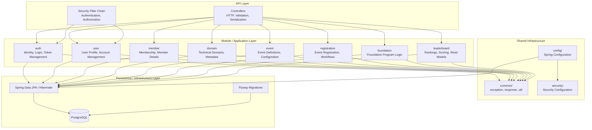

# MIT TECH KERNEL Backend - Architecture Overview

## High-Level Architecture



## Architectural Principles

1. **Modular Monolith**: Each business capability is isolated in its own module under `modules/`
2. **Layered Architecture**: Controllers → Services → Repositories → Entities
3. **Shared Infrastructure**: `config/`, `security/`, `common/` provide cross-cutting concerns
4. **Dependency Direction**: Modules depend on `common/`, never on each other directly
5. **Database per Module**: Each module owns its tables; cross-module queries via read models or explicit integration

## Package Structure

```
com.mittechkernel.backend
├── TechKernelApplication.java
├── config/                    # Spring @Configuration classes
├── security/                  # Security configuration, filters, handlers
├── common/
│   ├── exception/             # Global exception handling, base exceptions
│   ├── response/              # Standard API response wrappers
│   └── util/                  # Generic utilities (no business logic)
└── modules/
    ├── auth/                  # Authentication & session management
    ├── user/                  # User identity & account management
    ├── member/                # Membership & member-specific data
    ├── domain/                # Technical domains & metadata
    ├── event/                 # Event definitions & configuration
    ├── registration/          # Registration workflows & state
    ├── foundation/            # Foundation Program (separate scope)
    └── leaderboard/           # Rankings, scoring, read models
```

## Technology Stack

- **Java**: 25 (LTS)
- **Spring Boot**: 4.1.1
- **Build**: Maven
- **Database**: PostgreSQL 16
- **Migration**: Flyway
- **ORM**: Spring Data JPA / Hibernate
- **Security**: Spring Security
- **API**: Spring Web MVC
- **Validation**: Jakarta Bean Validation
- **Monitoring**: Spring Boot Actuator + Micrometer
- **Testing**: JUnit 5 + Spring Boot Test
- **Containerization**: Docker / Docker Compose